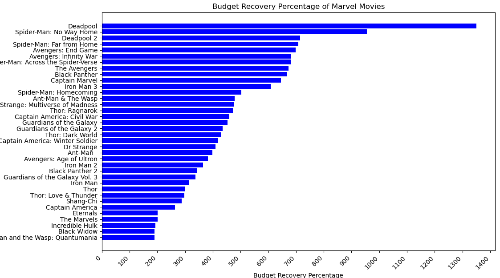

# Marvel Movie Data Visualization

The dataset used for this visualization and analysis was found on Kaggle. MARVEL Movies - Box Office Data; https://www.kaggle.com/datasets/jainaru/marvel-movies-box-office-data/data
I leveraged matplotlib, numpy, and pandas for my analysis and sklearn for regression.

The data contains 18 features:

- movie: Marvel movie title.
- category: Franchise category within the Marvel Universe. NOTE: the value 'unique' applies to independent films like "Shang-Chi".
- year: Release year.
- worldwide gross ($m): Total global earnings in millions of dollars.
- % budget recovered: Percentage of the budget recouped through global earnings.
- critics % score: Aggregated critics' rating percentage.
- audience % score: Aggregated audience rating percentage.
- audience vs critics % deviance: Percentage difference between audience and critics scores.
- budget ($m): Production cost in millions of dollars.
- domestic gross ($m): Earnings in the domestic market in millions of dollars.
- international gross ($m): Earnings in international markets in millions of dollars.
- opening weekend ($m): Earnings in the domestic market opening weekend.
- second weekend ($m): Earnings in the domestic market second weekend.
- 1st vs 2nd weekend drop off: % drop in earnings from the first to the second weekend.
- % gross from opening weekend: % total gross earned during opening weekend.
- % gross from domestic: % total gross from the domestic market.
- % gross from international: % total gross from international markets.
- % budget opening weekend: % budget recovered from opening weekend earnings.

## In this project I explored the following topics:

### Budget versus Revenue

I first considered Return on Investment (ROI) of Marvel Movies. As expected, ROI was extremely high across the data. Generally, Marvel Movies are efficient investments.

To visualize the relationship between the budget and worldwide gross of Marvel movies, I created a scatterplot with data points color-coded by category and sized according to ROI percentage.

This plot illustrates a few key insights.

1. The general upward trend indicates that movies with larger budgets often achieve higher worldwide gross earnings. However, the relationship isn’t strictly linear. Some movies with small budgets (relatively) perform very well.
2. The Avengers movies appear at the higher end of both budget and gross, indicating that this category is high-investment, high-return films. Deadpool shows aan extreme value with a high ROI despite the lowest budget.
3. Movies with smaller ROI percentages are clustered around a median budget range. This suggests that, although the movies where successful, they may need to see more significant return given the hefty budget.

### Budget Recovery

Following the previous analysis, I visualized budget recovery across each movie.

### Audience versus Critic Scores

I then pivoted to audience and critic ratings. I first visualized their deviance as a barplot across the movies. This was to potentially spot any extreme values such as high audience rating and very low critic rating.

I then considered the relationships between each score type and worldwide gross. I created two scatterplots depicting these trends and calculated correlation.

Correlation ~ Audience Score and Worldwide Gross: 0.261
Correlation ~ Critics Score and Worldwide Gross: 0.408

Out of curiosity, I attempted multiple regression to observe the possibility of predicting worldwide gross from critics' score, audience score, and budget. The following plot displays the results, the red dotted line indicating perfect predictions.

Mean Squared Error: 95729.24
R-squared Score: 0.64
This prediction does not appear to be particularly strong. I believe this can be attributed to the fact that despite varying budget, ratings across both types are generally very strong and consistent. Thus meaning there is little variance off of which earnings can be predicted.

### Relationship between Opening Weekend & Worldwide Gross

Lastly, I observed the relationship between opening weekend and worldwide gross. Marvel movies have significantly strong opening weekends, especially for highly anticipated releases.
The scatterplot below makes it quite clear that opening week reception holds a positive, linear relationship with worldwide gross.

Correlation ~ Opening Weekend and Worldwide Gross: 0.9428660566169369

Given this correlation, I attempted to predict worldwise gross from opening weekend gross. However, due to differences in magnitude and range, I first scaled the opening weekend values to complete regression.

Mean Squared Error: 29789.99
R-squared Score: 0.89
While not perfectly accurate, this prediction is quite consistent. This illustrates that in the case of Marvel movies, opening weekend gross is insightful for overall, worldwide success.
